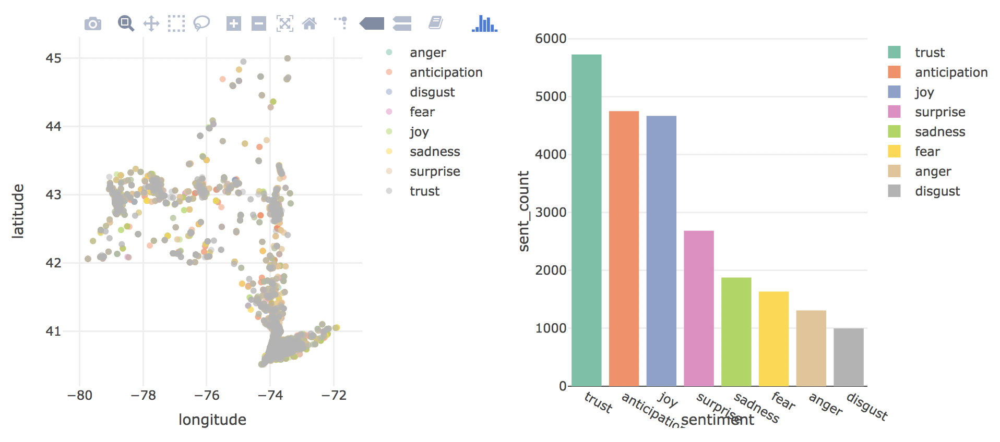

```{r setup, include=FALSE}
knitr::opts_chunk$set(message = FALSE, warning = FALSE)
```

```{r, include=FALSE}
library(syuzhet)
library(dplyr)
library(ggplot2)
library(scales)
library(tidyverse)
library(tidytext)
library(stringr)
library(forcats)
library(readr)
library(wordcloud)
library(RColorBrewer)
library(plotly)
library(choroplethr)
library(choroplethrMaps)
library(sp)
library(maps)
library(maptools)
library(stringi)
```


#Motivation
An analysis of almost any social media data can can be rather telling of how subgroups of a population interact with each other on a large scale. We are interested in the content of these interactions and how they vary throughout the United States over the few days that our data spans.

Ever wanted to know what everyone’s been tweeting about? Well, thanks to Twitter’s use of the hasthag system, that’s already possible. But how about the most popular places everyone’s been tweeting from? Or how about a simplified way to see how all those twitter users are feeling? Thanks to some in-depth exploratory analyses from [Dr. Jeff Goldsmith’s](http://jeffgoldsmith.com/DSI/) (Columbia University’s Mailman School of Public Health) Team Awesome$^{TM},  and courtesy of Followthehashtag’s publicly available twitter APIs, even this is possible. 

In a rapidly changing and increasingly tech-based world, people now have the power to essentially react to global events happening thousands of miles away in real time. Social media as whole, but twitter especially, are some of the biggest domains for capturing these reactions. Our team’s motivation for this analysis comes from a desire to aggregate these reactions in as compact and sensible format as possible. 


#Initial questions

Our initial ideas for analysis were: 


- Identify different languages

- Which accounts get the most traffic

- Geolocation traffic

- Any events happened during time period, measure influence

- Percent that use emoji’s, hashtags

- Positive/negative words, correlation with time?

- Percent of tweets devoted to a given topic: political, food, hobbies/lifestyle, etc.

- Correlation between location and sentiment

- Advertising percentage, success

- Content analysis: top tweets & retweets

- Correlation of tweets and events of days covered


As we looked at the dataset and analyzed the variables available to us, we found that some of these questions were outside of the scope of the information or tools available to us.

We decided to focus on just a few areas:


- Positive/negative words

- Correlation with time

- Correlation between location and sentiment


#Data 
The dataset we used from [Followthehashtag](http://followthehashtag.com/datasets/free-twitter-dataset-usa-200000-free-usa-tweets/) is a comprehensive but incomplete list of 200,000 tweets from users across the United States (and outside the U.S., but we focused on domestic tweets) from April 14, 2016 to April 16, 2016, which comes as an easy-to-access csv file within a zipped folder. For each tweet, user information such as name, location (latitude/longitude), number of followers, and the entire content of the tweet itself is given. 

We chose this dataset mainly because it was already in a nice form, and needed minimal cleaning. It included the varaibles we were interested in, such as tweet content for sentiment analysis and location data for mapping.

Throughout our project, we needed to subset the data because the initial data set was too large. We will explain more about this process in the sections below.

```{r load tweet data, cache = TRUE}
# The sentiment function takes a really long time so I created a new data file so it didn't have to be run each time
# The code to create the data file used throughout our analysis is found below 
# tweets <- 
#     read_excel("~/USA-Geolocated-tweets-free-dataset-Followthehashtag/dashboard_x_usa_x_filter_nativeretweets.xlsx", sheet = "Stream") %>%
#     janitor::clean_names() %>%
#     rename(tweet_language = tweet_language_iso_639_1) %>%
#     filter(tweet_language == "en") %>%
#     select(-tweet_language)
# 
# mySentiment <- get_nrc_sentiment(tweets$tweet_content)
# us_tweets <- cbind(tweets, mySentiment)
# write.csv(us_tweets, file = "us_tweets.csv")

us_tweets <- read_csv("us_tweets.csv") 

#gets rid of non alphabetic characters  
us_tweets$tweet_content_stripped <- gsub("[^[:alpha:] ]", "", us_tweets$tweet_content) 


#removes all words that are 1-2 letters long
us_tweets$tweet_content_stripped <- gsub(" *\\b[[:alpha:]]{1,2}\\b *", " ", us_tweets$tweet_content_stripped) 

#removes amp, abbreviation for ampersan
us_tweets$tweet_content_stripped <- gsub(" amp ", " ", us_tweets$tweet_content_stripped) 

#removes recurrence of jobs 
us_tweets$tweet_content_stripped <- gsub("jobs", " job ", us_tweets$tweet_content_stripped) 
us_tweets$tweet_content_stripped <- gsub("Jobs", " job ", us_tweets$tweet_content_stripped) 

```


#Challenges

We had a few challenges during this project, which mostly related to the data. Since we used an existing data set, we are not sure how the data was gathered. We noticed that there are some missing states or times. This may be because people were not tweeting or because "FollowtheHashtag" simply did not gather these data. We also needed to change formats, gather, and spread, in order to make the variables usable for analysis. When we made shiny apps, we had to subset the data because of limits on size.

#Exploratory analysis

We used the [Syuzhet package from GitHub](https://github.com/mjockers/syuzhet) (thank you Matthew Jockers!) to extract sentiments from tweet content. Our primary analyses consisted of mapping these tweets (using tweet location) as observable sentiments across the United States, which gives a nice aggregate picture of how the U.S. twitterverse was feeling during the dates mentioned above. 

About the Sentiment function:
Matthew Jockers’s sentiment function is essentially a dictionary that assigns different words to different sentiments. The general sentiments he uses in this function (and subsequently the ones we use in our analyses) are trust, joy, anger, sadness, fear, disgust, anticipation, and surprise. While some of these sentiments may not seem intuitive to use, altogether they form a relatively broad spectrum of moods and emotions which make for interesting analyses.


#Overall Tweet Analysis

The ‘overall analysis’ shows summarizing information on the tweets overall, not divided by state or sentiment, in order to give a better understanding of the dataset as a whole. Initial data cleaning for text mining included creating a new variable called tweet_content_stripped, which took initial tweet content and used pattern matching to remove non-alphabetic characters (i.e. numbers and symbols were removed) and words that were only one or two letters long. Additionally, we subsetted the data to only include tweets that were in English. 

The [resulting shiny](https://github.com/mdeferrante/twitter_shiny) uses a subset of the data, only 100,000 tweets, since the Shiny App could not host such a large dataset. The two visualizations in the the tabset show the most frequent words overall in tweet_content_stripped. Note that after plots were made, “jobs” and “amp” were included in the top words, but these were later recoded in tweet_content_stripped. Since ‘job’ already appeared in the most frequent words, to avoid redundancy ‘jobs’ was recoded to ‘job’, and thus the top word in the bar chart includes count for the appearance of both jobs and jobs. ‘Amp’ was removed in the tweet_content_stripped, since we determined this was an abbreviation for ampersand and thus not meaningful for our data. 

The output below shows total counts for all sentiments found in tweets in the dataset. Each tweet might have more than one sentiment. 

```{r create sentiment totals}
sentimentTotals <- data.frame(colSums(us_tweets[,c(20:27)]))

names(sentimentTotals) <- "count"

sentimentTotals <- cbind("sentiment" = rownames(sentimentTotals),
                         sentimentTotals)

sentimentTotals
```


```{r Converts to long format}
us_tweets_long <- gather(us_tweets, sentiment, count, anger:trust, 
                         factor_key = TRUE)
```


Number of tweets per hour (below) is a time series plot showing the distribution of tweets at different hours of the day. The dataset includes recorded tweets across a 48 hour span, so we found it interesting that we are missing some time intervals at the same time both days. This could be related to the way in which the data was collected, but provided information on the data does not mention why these gaps occur.

```{r number of tweets per hour}
us_tweets$hour <- as.POSIXct(us_tweets$hour, format = " %H:%M")

#generates plot of distribution of plots across time
tweets_over_time <- 
  ggplot(data = us_tweets, aes(x = hour)) +
  geom_histogram(stat = "count") +
  xlab("Time") + ylab("Number of Tweets") +
  ggtitle("Number of Tweets per Hour") +
  scale_x_datetime(labels = date_format("%H:%M"), breaks = pretty_breaks(n = 10))

```

This plot was part of our exploratory data analysis. It shows number of characters per tweet. Although interesting, we did not feel it was relevant to our final website analyses and was not included in the website. 

```{r characters per tweet}
us_tweets$charsintweet <- sapply(us_tweets$tweet_content, function(x) nchar(x))

ggplot(data = us_tweets, aes(x = charsintweet)) +
  geom_histogram(aes(fill = ..count..), binwidth = 8) +
  theme(legend.position = "none") +
  xlab("Characters per Tweet") + 
  ylab("Number of tweets") + 
  scale_fill_gradient(low = "midnightblue", high = "aquamarine4") + 
  xlim(0,150) + 
  ggtitle("Characters per Tweet")
```

The sentiments plot below gives an general understanding of the most common sentiments throughout the tweets. When observing comparisons of states, it can be helpful to see the overall distribution of sentiments so that we can recognize states that have contrasting distributions of these sentiments. 

```{r sentiments for tweets}
ggplot(data = sentimentTotals, aes(x = sentiment, y = count)) +
  geom_bar(aes(fill = sentiment), stat = "identity") +
  theme(legend.position = "none") +
  xlab("Sentiment") + 
  ylab("Total Count") + 
  ggtitle("Total Sentiment Score for All Tweets in Sample")
```

The interactive word cloud in our shiny app does not work on the Rmd, so the below word cloud is not the same as what we have on our website, but I will give a description of the word cloud that can be found on our website. The word cloud was generated using a subset where only words appearing more than 200 times are included. The website has a zoom slider allows you to zoom in and out to see some of the most and least frequent words (of frequency over 200). Word size corresponds to frequency, and zooming out to .5 shows the most frequent words used in the tweets, but due to the large proportion of more frequent words, it makes it very difficult to see less common words. Hovering the cursor over each word shows its frequency among all the tweets. The word cloud generated spaces the words differently and in different colors each time it is loaded, but the word sizes remain the same for each zoom amount. 

```{r word cloud}
tweet_words <- us_tweets %>% 
  unnest_tokens(word, tweet_content_stripped)

data(stop_words)

tweet_words <-  
  anti_join(tweet_words, stop_words)

tweet_words %>%
  count(word) %>%
  with(wordcloud(word, n, max.words = 200, 
                 random.order = FALSE, 
                 rot.per = 0.35,  
                 colors = brewer.pal(2, "Dark2")))
```

The bar chart provides a more simple representation of common words, showing the top 10 most frequent words. These top 10 words, starting with the most frequent, are job, hiring, careerarc, click, retail, recommend, fit, hospitality, apply, and sales.

```{r top 10 words}
pal2 <- brewer.pal(8,"Dark2")

#creates bar chart of 10 most frequent words
top_words <-
  tweet_words %>% 
  count(word, sort = TRUE) %>% 
  top_n(10) %>% 
  mutate(word = fct_reorder(word, n)) %>% 
  ggplot(aes(x = word, y = n)) + 
  geom_bar(stat = "identity", fill = "blue", alpha = .6) + 
  coord_flip() +
  labs(title = "10 Most Frequent Words", y = "Count", x = "Word")

top_words
```

Below we see the 20 most frequent hash-tags in the dataset. This did not add more information, so we did not use in subsequent analysis. 

```{r hashtag df}
hashtags <- str_extract_all(us_tweets$tweet_content, "#\\S+")
hashtags <- unlist(hashtags)
hashtags <- gsub("[^[:alnum:] ]", "", hashtags)
hashtags <- tolower(hashtags)
hashtag.df <- data.frame(table(hashtags))
hashtag.df$hashtags <- as.character(hashtag.df$hashtags)
hashtag.df$Freq <- as.numeric(as.character(hashtag.df$Freq))
hashtag.df <- arrange(hashtag.df, desc(Freq))
print(hashtag.df[1:20,])
```


#US Tweet Mapping

A shiny repo for this analysis can be found: [here](https://github.com/k-maciejewski/p8105_final_shinyUS). The shiny [app](https://kmaciejewski.shinyapps.io/p8105_final_shinyus/) allows further interaction with the data. The below plots are not interactive, since using plotly would substantially slow compiling of the file.

In order to create the aggregate U.S. maps, we filtered location to only include US, and plotted longitude, latitude and outcome of interest.

When mapping the positive scores for all tweets, we see that there is a moderate to low score through the US. At this scale, we cannot see a definitive trend. We also see that there are not a lot of tweets generated in the midwest or north west. This may be because there are fewer people living in these sections of the country, or because the site "Followthehashtag" simply did not scrape data from these locations. There does seem that there are slightly more positive tweets from the middle of the country.

```{r map positive tweets all US in ggplot}
#positive tweets, ggplot
us_tweets %>%
  filter(country == "US") %>% 
  ggplot(aes(x = longitude, y = latitude, color = positive)) + 
  geom_point(alpha = .6) +
  scale_colour_gradientn(colours = rainbow(10)) +
  ggtitle("Positive Tweets")
```

When mapping sentiment across all US, we see an overwhelming amount of "trust" tweets. We are not quite sure what this emotion means. We found that most tweets including "job" or "jobs" mapped to the emotion "trust." There are many tweets with those words, so it may be interesting to filter out that emotion.
  
```{r map tweet sentiments all US}  
#name of sentiment, ggplot
us_tweets_long %>%
  filter(country == "US") %>% 
  filter(count > 0) %>% 
  ggplot(aes(x = longitude, y = latitude, color = factor(sentiment))) + 
  geom_point(alpha = .6)+
  ggtitle("Tweet Sentiments") +
  scale_color_discrete(name="Sentiment")

```

When we filter out trust, we see that surprise and joy seem to be commonly tweeted emotions.

```{r map_tweet_sentiments_no_trust}  
#name of sentiment, ggplot
us_tweets_long %>%
  filter(country == "US") %>% 
  filter(count > 0) %>% 
  filter(sentiment != "trust") %>% 
  ggplot(aes(x = longitude, y = latitude, color = factor(sentiment))) + 
  geom_point(alpha = .6)+
  ggtitle("Tweet Sentiments") +
  scale_color_discrete(name="Sentiment")

```


Due to the fact that our location column displays differences in specificity, we built a function that took the latitude and longitude of each tweet and converted it to the state in which the tweet originated from. We then proceeded to add that to our original dataset. 

```{r map by state}
state_tweets = us_tweets %>%
  select("longitude", "latitude")

latlong2state <- function(state_tweets) {
    states <- map('state', fill=TRUE, col="transparent", plot=FALSE)
    IDs <- sapply(strsplit(states$names, ":"), function(x) x[1])
    states_sp <- map2SpatialPolygons(states, IDs=IDs,
                     proj4string=CRS("+proj=longlat +datum=WGS84"))

    states_tweets_SP <- SpatialPoints(state_tweets, 
                    proj4string=CRS("+proj=longlat +datum=WGS84"))
    
    indices <- over(states_tweets_SP, states_sp)

    stateNames <- sapply(states_sp@polygons, function(x) x@ID)
    stateNames[indices]
}

state_name = latlong2state(state_tweets)

us_tweets = cbind(state_name, us_tweets)
```

To evaluate overall sentiment by state, we selected the appropriate columns, then grouped and summed by state, making sure to discount missing locations. Maine, Alaska and Hawaii were not included in this survey, however the 48 state count comes from Virginia and the District of Columbia recieving individual designations. 

```{r sum across states}
us_sentiments = us_tweets %>%
  filter(country == "US") %>%
  select(c(1, 21:30)) %>%
  na.omit(state_name) %>%
  group_by(state_name) %>%
  summarise_all(funs(sum)) %>%
  mutate(positive = as.numeric(positive),
         negative = as.numeric(negative))
```

The following heatmaps show the level of negative and positive sentiment across the United States during the 48 hour period of our dataset. Maine, Alaska and Hawaii are blacked out, as tweets from those states were not recorded. 

We can observe with these two maps that states like California and Texas are consistently the highest ranked, which can be assumed to be population related. It is interesting because the state with the lowest positive and negative sentiment scores is Washington. This could be for two reasons: population difference or that tweets have less sentimental words than other states and therefore don't generate as strong sentiment scores. 

```{r graph state heat map}
us_sentiments %>%
  select("state_name", "negative") %>%
  rename(region = state_name, value = negative) %>%
  state_choropleth(title = "Negative Sentiment across the U.S.",
                   legend = "Sentiment Score")  

us_sentiments %>%
  select("state_name", "positive") %>%
  rename(region = state_name, value = positive) %>%
  state_choropleth(title = "Positive Sentiment Across the U.S.",
                   legend = "Sentiment Score")
```

By selecting the state name and corresponding sentiment columnns and renaming them to fit the state_choropleth function, we can then apply them and the state_choropleth function to fill the state shapes with the appropriate level of shading for their sum values. 

To modify these results to function in plotly and become interactive on shiny, the plot_geo function was used. Radio buttons were created by first converting the dataset to long format with regard to negative and positive sentiment. Then when the sentiment value is positive or negative, it will show the appropriate sums. Also, the hover function is used to print all the other sentiment totals when hovering the cursor over the specific state. The specific code is shown below.

us_sentiments = gather(us_sentiments, neg_pos, count, negative:positive, factor_key = TRUE)
state_pos_neg = us_sentiments %>% distinct(neg_pos) %>% pull()

radioButtons("state_pos_neg", label= h3("Select Positive or Negative Sentiment Totals"), choices = state_pos_neg, selected = NULL,  inline = T, width = NULL, choiceNames = NULL, choiceValues = NULL)

renderPlotly({
g <- list(scope = 'usa',
          projection = list(type = 'albers usa'))

us_sentiments$hover <- with(us_sentiments, paste(state_name, '<br>', "Anger", anger, "Anticipation", anticipation, "<br>",
                           "Disgust", disgust, "Fear", fear,
                           "<br>", "Joy", joy, "Sadness", sadness, '<br>', "Surprise", surprise, "Trust", trust))

plot_geo(us_sentiments, locationmode = 'USA-states') %>%
  filter(neg_pos == input$state_pos_neg) %>%
  add_trace(z = ~count, text = ~hover, locations = ~abr, color = ~count, colors = 'Reds') %>%
  layout(title = 'Sentiment Sums across the U.S.',
         geo = g)}
         

In order to make the shiny app work, we needed to subset the data; the initial csv was too large. By filtering for the United States, then selecting the sentiment variables, latitude and longitude, hour and the logged location from the twitter account, we were able to complete the following analysis. 

#By-state Analysis


A shiny repo is [here](https://github.com/k-maciejewski/p8105_final_shiny_app) and the app can be accessed [here](https://np2547.shinyapps.io/states_shiny/).

The plots above for New York are an example of the interactive State Shiny App created to offer the opportunity to compare states.  The plots in the State Shiny App were created in plotly and widgets were created to choose the first and the second state in a drop down manner.  The location plots displays tweet sentiments across latitude and longitude location for the state. The bar graph displays counts of sentiments to specify which sentiments were most expressed in the state, as this was not always apparent in areas of heavy tweeting.

One of the main goals in this comparison was to obtain as much state information as possible to create the most comprehensive plots. Location data was contained in a “place as appears on bio” column, which was based on the location users set, as well as latitude and longitude.  As a result, we used both sets of location data to index out/obtain state names. 

Obtaining data through latitude and longitude proved to be valuable, but unfortunately still left us with approximately 20,000 missing values for state.  We resorted to parsing the data in the place as appears on bio column to explore whether we can get any of those missing values filled in via the information in that column.  Two formats seemed to be popular, “StateName, USA” and “City, StateAbbreviation”.  We focused on extracting the data from these two formats, as they would most likely give us the most information (line by line explanation can be found in code).  After filling in for as many missing values as we could from the information we gathered from place as appears on bio, we were able to get missingness down to under 2,000 observations.


#Discussion

###Current Events: April 14, 2016 to April 16, 2016

In a world where news breaks so frequently and the time frame for an event to be deemed "current" is arguably shorter than a day, April 2016 might seem a lot farther back in the past than it actually was. Believe it or not, there were actually quite a few notable events around the world that took place in this short span. Our goal in this section was to try and tie the emotions of twitter users at the time to events they were responding to, hoping to make logical connections about why tweets express the sentiments that they do.

That being said, some of the most notable events from April 14 to April 16 of 2016 include: The Golden State Warriors finishing the NBA season with the best record in history, Hillary Clinton and Bernie Sanders' have a contentious debate in New York City, deadly earthquakes strike Japan, North Korea fails in a missile-launch attempt, and public health officials confirmed a link between the Zika virus and the devastating birth defect microcephaly. Obviously this is not a comprehensive list, but is sufficient enough to say that the average twitter user would have heard of at least one the events.

##What conclusions can we draw?

The list of events above is also sufficient enough such that they would elicit the whole range of emotions from twitter users that we used in our analyses (anger, anticipation, disgust, fear, joy sadness, surprise, trust). Thus, we can generally expect specific tweets with certain sentiments to correlate with at least some of these events (Example: a tweet expressing joy has decent chance of being about the Warriors' season, and a tweet expressing sadness has decent chance of being about the earthquakes in Japan).

As expected, we see more highly concentrated tweet distributions in more populated areas. Perhaps less expected, we see that the distribution of all the sentiments is relatively equal across all the regions of the U.S. From this, we can make a general inference about information spread across the U.S.: it's fairly equal, and not particularly subject to geographical discrimination. Due to the nature of the dataset, there are certainly many more interesting conclusions that can be made that we haven't yet!

##Acknowledgement of the limitations of Twitter:

Since neither Twitter or our data analyses will ever be perfect, there are some limitations we'd like to address. Twitter, like many other account-based social media sites, is full of bots, which are essentially non-human users capable of generating tweets and other content (but frequently produce spam and other irrelevant information). A quick glance at the dataset shows that there is very likely a large number of spam-bots posing as users in the dataset, something that is very difficult to control for, especially when these bots are capable of producing content that is hard to distinguish from what a human user might write. That being said, a sentiment analysis of twitterbots (which is intrinsically a part of our analysis) can yield unpredicatble  results. However, we did pick up on a rather noticeable trend, particularly when examining word and sentiment frequencies. The word "job" is by far the most prevalent word, and "trust" is by far the most prevalent sentiment. It is not unreasonable to say that many of twitterbots in this dataset are responsible for both of these occurrences. With that in mind, the rampant predominance of "jobs" and "trust" becomes understandable, and further analyses of word frequencies and sentiment dispersion become more intuitive (especially when looking at the sentiment plots with "trust" removed). 

